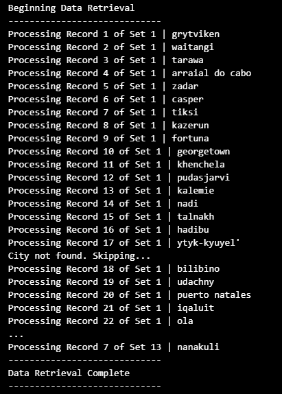
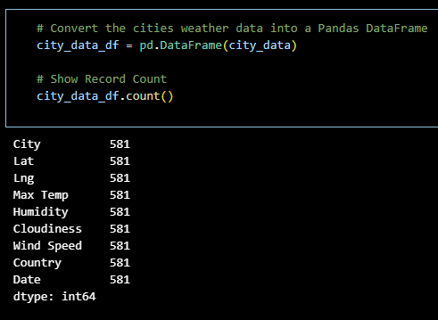
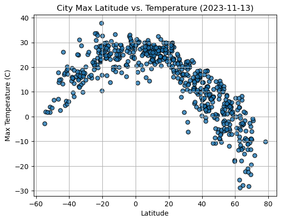
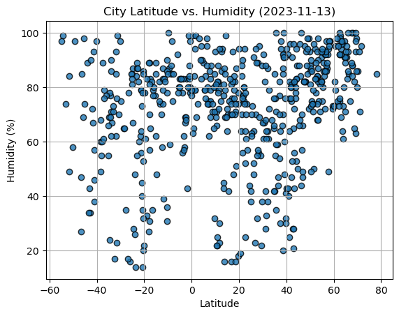
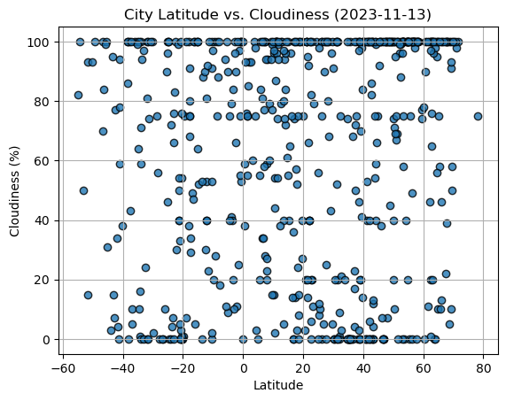

# Python-API-Challenge
### Python API for Weather and Vacation Planning
## Introduction
**Part 1 -  WeatherPy**: The creation of a Python script to visualize the weather of over 500 cities of varying distances from the equator is outlined. Leveraging the `citipy` Python library, the OpenWeatherMap API (https://openweathermap.org/api), and adept problem-solving skills, a comprehensive model of weather patterns across diverse cities is constructed.

**Part 2 - VacationPy**: The utilization of weather data skills to strategize future vacations is emphasized. Through the employment of Jupyter notebooks, the `hvPlot` Python library, and the Geoapify API (https://www.geoapify.com/), provides code that streamlines the process by importing required libraries and loading the CSV file containing weather and coordinates data for each city created in *Part 1*.
Primary objectives involve utilizing the Geoapify API and `hvPlot` Python library showcases proficiency in Python to craft compelling map visualizations that aid in vacation planning.

## Part 1: WeatherPy
### Imports
    # Dependencies and Setup
    import matplotlib.pyplot as plt
    import pandas as pd
    import numpy as np
    import requests
    import time
    from scipy.stats import linregress

    # Import the OpenWeatherMap API key
    from api_key_main import weather_api_key

    # Import citipy to determine the cities based on latitude and longitude
    from citipy import citipy

### Gather data
**Generate the Cities List by Using the `citipy` Library**

    # Empty list for holding the latitude and longitude combinations
    lat_lngs = []

    # Empty list for holding the cities names
    cities = []

    # Range of latitudes and longitudes
    lat_range = (-90, 90)
    lng_range = (-180, 180)

    # Create a set of random lat and lng combinations
    #this is a random set, so the list will always be a different length
    lats = np.random.uniform(lat_range[0], lat_range[1], size=1500)
    lngs = np.random.uniform(lng_range[0], lng_range[1], size=1500)
    lat_lngs = zip(lats, lngs)

    # Identify nearest city for each lat, lng combination
    for lat_lng in lat_lngs:
        city = citipy.nearest_city(lat_lng[0], lat_lng[1]).city_name
        
        # If the city is unique, then add it to a our cities list, filter out duplicates
        if city not in cities:
            cities.append(city)

    # Print the city count to confirm sufficient count
    print(f"Number of cities in the list: {len(cities)}")

    Output: Number of cities in the list: 608

### Use the OpenWeatherMap API to retrieve weather data from the cities list generated in the started code

    # Set the API base URL
    url = "http://api.openweathermap.org/data/2.5/weather?"
    units = "metric"

**Fetch data** 

    # Define an empty list to fetch the weather data for each city
    city_data = []

    # Print to logger
    print("Beginning Data Retrieval     ")
    print("-----------------------------")

    # Create counters
    record_count = 1
    set_count = 1

    # Loop through all the cities in our list to fetch weather data
    for i, city in enumerate(cities):
            
        # Group cities in sets of 50 for logging purposes
        if (i % 50 == 0 and i >= 50):
            set_count += 1
            record_count = 0

        # Create endpoint URL with each city
        city_url = f"{url}appid={weather_api_key}&q={city}&units={units}"
        
        # Log the url, record, and set numbers
        print("Processing Record %s of Set %s | %s" % (record_count, set_count, city))

        # Add 1 to the record count
        record_count += 1

        # Run an API request for each of the cities
        try:
            # Parse the JSON and retrieve data
            city_weather =  requests.get( city_url)
            weather_json = city_weather.json()

            # Parse out latitude, longitude, max temp, humidity, cloudiness, wind speed, country, and date
            city_lat =  weather_json["coord"]["lat"]
            city_lng = weather_json["coord"]["lon"]
            city_max_temp = weather_json["main"]["temp_max"]
            city_humidity = weather_json["main"]["humidity"]
            city_clouds = weather_json["clouds"]["all"]
            city_wind = weather_json["wind"]["speed"]
            city_country = weather_json["sys"]["country"]
            city_date = weather_json["dt"]

            # Append the City information into city_data list
            city_data.append({"City": city, 
                            "Lat": city_lat, 
                            "Lng": city_lng, 
                            "Max Temp": city_max_temp,
                            "Humidity": city_humidity,
                            "Cloudiness": city_clouds,
                            "Wind Speed": city_wind,
                            "Country": city_country,
                            "Date": city_date})

        # If an error is experienced, skip the city
        except:
            print("City not found. Skipping...")
            pass
                
    # Indicate that Data Loading is complete 
    print("-----------------------------")
    print("Data Retrieval Complete      ")
    print("-----------------------------")

**Output**

**Create Dataframe from retrieved data**

**Export data to cvs file**

    # Export the City_Data into a csv
    city_data_df.to_csv("output_data/cities.csv", index_label="City_ID")

**Read saved data back into notebook**

    # Read saved data
    city_data_df = pd.read_csv("output_data/cities.csv", index_col="City_ID")

    # Display sample data
    city_data_df.head()

### Create Scatter Plots

**Latitude vs. Temperature**

Sample code for all plots:

    # Build scatter plot for latitude vs. temperature
    plt.scatter(     
        city_data_df["Lat"],
        city_data_df["Max Temp"],
        edgecolor="black",
        linewidths=1,
        marker="o", 
        alpha=0.8,
        label="Cities"
    )
    plt.grid()
    plt.xlabel('Latitude')
    plt.ylabel('Max Temperature (C)')
    # Incorporate the other graph properties
    plt.title("City Max Latitude vs. Temperature (%s)" % time.strftime("%Y-%m-%d"))

    # Save the figure
    plt.savefig("output_data/Fig1.png")

    # Show plot
    plt.show()

**Latitude vs. Humidity**

**Latitude vs. Cloudiness**

### Compute Linear Regression for Each Relationship

### Results

## Part 2: VacationPy

### Imports

### ETL

### Analysis

### Results

## Conclusion
