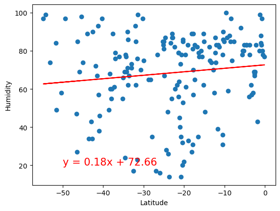

# Python API for Weather and Vacation Planning
## Introduction
**Part 1 -  WeatherPy**: The first portion of this project involves the creation of a Python script to visualize the weather of over 500 cities of varying distances from the equator. Leveraging the `citipy` Python library and the OpenWeatherMap API (https://openweathermap.org/api), a comprehensive *model of weather patterns* across diverse cities is constructed.

**Part 2 - VacationPy**: The primary objective of the second portion of this project involves utilizing the Geoapify API (https://www.geoapify.com/) and `hvPlot` Python library to showcase proficiency in Python to craft compelling map visualizations that aid in *vacation planning*. The code streamlines the process by importing required libraries and loading the CSV file containing weather and coordinate data for each city created in *Part 1*. 

## Part 1: WeatherPy
### Imports
    # Dependencies and Setup
    import matplotlib.pyplot as plt
    import pandas as pd
    import numpy as np
    import requests
    import time
    from scipy.stats import linregress

    # Import the OpenWeatherMap API key
    from api_key_main import weather_api_key

    # Import citipy to determine the cities based on latitude and longitude
    from citipy import citipy

### Gather data
**Generate the Cities List by Using the `citipy` Library**

    # Empty list for holding the latitude and longitude combinations
    lat_lngs = []

    # Empty list for holding the cities names
    cities = []

    # Range of latitudes and longitudes
    lat_range = (-90, 90)
    lng_range = (-180, 180)

    # Create a set of random lat and lng combinations
    #this is a random set, so the list will always be a different length
    lats = np.random.uniform(lat_range[0], lat_range[1], size=1500)
    lngs = np.random.uniform(lng_range[0], lng_range[1], size=1500)
    lat_lngs = zip(lats, lngs)

    # Identify nearest city for each lat, lng combination
    for lat_lng in lat_lngs:
        city = citipy.nearest_city(lat_lng[0], lat_lng[1]).city_name
        
        # If the city is unique, then add it to a our cities list, filter out duplicates
        if city not in cities:
            cities.append(city)

    # Print the city count to confirm sufficient count
    print(f"Number of cities in the list: {len(cities)}")

    Output: Number of cities in the list: 608

### Use the OpenWeatherMap API to retrieve weather data from the cities list generated

    # Set the API base URL
    url = "http://api.openweathermap.org/data/2.5/weather?"
    units = "metric"

**Fetch data** 

    # Define an empty list to fetch the weather data for each city
    city_data = []

    # Print to logger
    print("Beginning Data Retrieval     ")
    print("-----------------------------")

    # Create counters
    record_count = 1
    set_count = 1

    # Loop through all the cities in our list to fetch weather data
    for i, city in enumerate(cities):
            
        # Group cities in sets of 50 for logging purposes
        if (i % 50 == 0 and i >= 50):
            set_count += 1
            record_count = 0

        # Create endpoint URL with each city
        city_url = f"{url}appid={weather_api_key}&q={city}&units={units}"
        
        # Log the url, record, and set numbers
        print("Processing Record %s of Set %s | %s" % (record_count, set_count, city))

        # Add 1 to the record count
        record_count += 1

        # Run an API request for each of the cities
        try:
            # Parse the JSON and retrieve data
            city_weather =  requests.get( city_url)
            weather_json = city_weather.json()

            # Parse out latitude, longitude, max temp, humidity, cloudiness, wind speed, country, and date
            city_lat =  weather_json["coord"]["lat"]
            city_lng = weather_json["coord"]["lon"]
            city_max_temp = weather_json["main"]["temp_max"]
            city_humidity = weather_json["main"]["humidity"]
            city_clouds = weather_json["clouds"]["all"]
            city_wind = weather_json["wind"]["speed"]
            city_country = weather_json["sys"]["country"]
            city_date = weather_json["dt"]

            # Append the City information into city_data list
            city_data.append({"City": city, 
                            "Lat": city_lat, 
                            "Lng": city_lng, 
                            "Max Temp": city_max_temp,
                            "Humidity": city_humidity,
                            "Cloudiness": city_clouds,
                            "Wind Speed": city_wind,
                            "Country": city_country,
                            "Date": city_date})

        # If an error is experienced, skip the city
        except:
            print("City not found. Skipping...")
            pass
                
    # Indicate that Data Loading is complete 
    print("-----------------------------")
    print("Data Retrieval Complete      ")
    print("-----------------------------")

**Output**

**Create Dataframe from retrieved data**

**Export data to cvs file**

    city_data_df.to_csv("output_data/cities.csv", index_label="City_ID")

**Read saved data back into notebook**

    city_data_df = pd.read_csv("output_data/cities.csv", index_col="City_ID")

## Create Scatter Plots

**Latitude vs. Temperature**

Sample code for all plots:

    # Build scatter plot for latitude vs. temperature
    plt.scatter(     
        city_data_df["Lat"],
        city_data_df["Max Temp"],
        edgecolor="black",
        linewidths=1,
        marker="o", 
        alpha=0.8,
        label="Cities"
    )
    plt.grid()
    plt.xlabel('Latitude')
    plt.ylabel('Max Temperature (C)')
    # Incorporate the other graph properties
    plt.title("City Max Latitude vs. Temperature (%s)" % time.strftime("%Y-%m-%d"))

    # Save the figure
    plt.savefig("output_data/Fig1.png")

    # Show plot
    plt.show()

**Latitude vs. Humidity**

**Latitude vs. Cloudiness**

## Compute Linear Regression for Each Relationship

Define a function to create Linear Regression plots

    def plot_linear_regression(x_values, y_values, title, text_coordinates):
        
        # Compute linear regression
        (slope, intercept, rvalue, pvalue, stderr) = linregress(x_values, y_values)
        regress_values = x_values * slope + intercept
        line_eq = "y = " + str(round(slope,2)) + "x + " + str(round(intercept,2))

        # Plot
        plt.scatter(x_values,y_values)
        plt.plot(x_values,regress_values,"r-")
        plt.annotate(line_eq,text_coordinates,fontsize=15,color="red")
        plt.xlabel("Latitude")
        plt.ylabel(title)
        print(f"The r-value is: {rvalue**2}")
        plt.show()

Create a DataFrame with the Northern Hemisphere data (Latitude >= 0)

    northern_hemi_df = city_data_df.loc[city_data_df["Lat"] >= 0]

Create a DataFrame with the Southern Hemisphere data (Latitude < 0)

    southern_hemi_df = city_data_df.loc[city_data_df["Lat"] < 0]

## Results of Linear Regression 

### Temperature vs. Latitude

Linear regression of *Northern Hemisphere*

    x_values = northern_hemi_df["Lat"]
    y_values = northern_hemi_df["Max Temp"]
    plot_linear_regression(x_values, y_values, "Max Temp",(10,-20))

The r-value is: 0.7692858976134047

Linear regression on *Southern Hemisphere*

    x_values = southern_hemi_df["Lat"]
    y_values = southern_hemi_df["Max Temp"]
    plot_linear_regression(x_values, y_values, "Max Temp",(-30,5))

The r-value is: 0.5098241499387984

**Discussion about the linear relationship:** The linear regression line for temperature vs latitude is negative in the Northern Hemisphere and is positive in the Southern Hemisphere. The correlation factor of in the Northern hemisphere is 0.77 which is considered a strong correlation. The correlation factor in the Southern hemisphere is 0.51 which is considered to be a weak correlation. At the equator, which is latitude of zero, the sun hits the earth in a direct fashion. The sun will cause the temperature to be warmer when the latitude is closer to zero, which is reflected in the plot. As the latitude becomes greater, in the Northern Hemisphere, the temperature goes down as it approaches the Arctic Circle. 

### Humidity vs. Latitude 

Linear regression of *Northern Hemisphere*

    x_values = northern_hemi_df["Lat"]
    y_values = northern_hemi_df["Humidity"]
    plot_linear_regression(x_values, y_values, "Humidity",(45,20))

The r-value is: 0.06415513377509181

Linear regression on *Southern Hemisphere*

    x_values = southern_hemi_df["Lat"]
    y_values = southern_hemi_df["Humidity"]
    plot_linear_regression(x_values, y_values, "Humidity",(-50,20))

The r-value is: 0.01447880640915222

**Discussion about the linear relationship:** The linear regression line for humidity vs latitude is positive in both Northen Hemiphere and Southern Hemisphere. The correlation for both hemispheres are below 0.3, which is considered no or very weak correlation.

### Cloudiness vs. Latitude 

Linear regression of *Northern Hemisphere*

    x_values = northern_hemi_df["Lat"]
    y_values = northern_hemi_df["Cloudiness"]
    plot_linear_regression(x_values, y_values, "Cloudiness",(45,25))

The r-value is: 0.011509488974979111

Linear regression on *Southern Hemisphere*

    x_values = southern_hemi_df["Lat"]
    y_values = southern_hemi_df["Cloudiness"]
    plot_linear_regression(x_values, y_values, "Cloudiness",(-50,25))

The r-value is: 0.0008701936660440692

**Discussion about the linear relationship:** The linear regression line in both the Northern and Southern Hemisphere is positive for cloudiness vs latitude. However, the correlation factor for both hemispheres is below 0.3, which is considered no or very weak correlation. 

**Conclusion:** The only significant finding in correlation, considering all plots, is a direct correlation in the Northern Hemisphere of Temperature vs. Latitude.

## Part 2: VacationPy

### Imports

    # Dependencies and Setup
    import hvplot.pandas
    import pandas as pd
    import requests

    # Import API key
    from api_key_main import geoapify_key

### Load the CSV file created in Part 1 into a Pandas DataFrame

    city_data_df = pd.read_csv("output_data/cities.csv")

### Create a map that displays a point for every city in the `city_data_df` DataFrame. The size of the point is the humidity in each city.

    # Configure the map plot_1
    map_plot_1 = city_data_df.hvplot.points(
        "Lng",
        "Lat",
        geo = True,
        tiles = "OSM",
        frame_width = 700,
        frame_height = 500, 
        size = "Humidity", 
        scale = 1,
        color = "City",
        alpha = 0.5  
    )

    # Display the map
    map_plot_1

### Narrow down the `city_data_df` DataFrame to find your ideal weather condition

    # Narrow down cities that fit criteria and drop any results with null values
    city_ideal_df = city_data_df

    #Ideal conditions Max Temp > 21C, Max Temp < 27C, Wind Speed < 4.5 m/s, and 0 cloudiness
    city_ideal_df = city_ideal_df.loc[(city_ideal_df["Max Temp"] > 21) & (city_ideal_df["Max Temp"] < 27)]
    city_ideal_df = city_ideal_df.loc[city_ideal_df["Wind Speed"] < 4.5]
    city_ideal_df = city_ideal_df.loc[city_ideal_df["Cloudiness"] == 0]

    # Drop any rows with null values
    city_ideal_df = city_ideal_df.dropna()

### Create a new DataFrame called `hotel_df` with ideal conditions (Max Temp > 21C, Max Temp < 27C, Wind Speed < 4.5 m/s, and 0 cloudiness)

    # Use the Pandas copy function to create DataFrame called hotel_df to store the city, country, coordinates, and humidity
    hotel_df = pd.DataFrame(city_ideal_df, columns = ["City", "Country", "Lat", "Lng", "Humidity", "Hotel Name"])

    # Add an empty column, "Hotel Name," to the DataFrame so you can store the hotel found using the Geoapify API
    hotel_df["Hotel Name"] = ""

### For each city, use the Geoapify API to find the first hotel located within 10,000 metres of your coordinates

    # Set parameters to search for a hotel
    radius = 10000 
    params = {
            "categories" : "accommodation.hotel",
            "apiKey" : geoapify_key
            }

    # Print a message to follow up the hotel search
    print("Starting hotel search")

    # Iterate through the hotel_df DataFrame
    for index, row in hotel_df.iterrows():
        # get latitude, longitude from the DataFrame
        longitude = row["Lng"]
        latitude = row["Lat"]
        # Add filter and bias parameters with the current city's latitude and longitude to the params dictionary
        params["filter"] =  f"circle:{longitude},{latitude},{radius}"
        params["bias"] = f"proximity:{longitude},{latitude}"
        # Set base URL
        base_url = "https://api.geoapify.com/v2/places"
        
        # Make and API request using the params dictionaty
        name_address = requests.get(base_url, params = params)
        # Convert the API response to JSON format
        name_address = name_address.json()
        
        # Grab the first hotel from the results and store the name in the hotel_df DataFrame
        try:
            hotel_df.loc[index, "Hotel Name"] = name_address["features"][0]["properties"]["name"]
        except (KeyError, IndexError):
            # If no hotel is found, set the hotel name as "No hotel found".
            hotel_df.loc[index, "Hotel Name"] = "No hotel found"    
        # Log the search results
        print(f"{hotel_df.loc[index, 'City']} - nearest hotel: {hotel_df.loc[index, 'Hotel Name']}") 

    # Display sample data
    hotel_df 

### Add the hotel name and the country as additional information in the hover message for each city in the map

    map_plot_2 = hotel_df.hvplot.points(
        "Lng",
        "Lat",
        geo = True,
        tiles = "OSM",
        frame_width = 700,
        frame_height = 500, 
        size = "Humidity", 
        scale = 1,
        color = "City",
        hover_cols = ["Hotel Name", "Country"],
        alpha = 0.5  
    )

    # Display the map
    map_plot_2

*Example of Hover message*

## Conclusion

The following hotels are available, considering the ideal weather conditions of Max Temp > 21C, Max Temp < 27C, Wind Speed < 4.5 m/s, and 0 cloudiness.

1. Brak Tourist Hotel (فندق براك السياحي) in Brak, Libya.
2. Villa Carparis in Rizokarpaso, Cyprus.
3. Pousada Vitória in Sao Vicente, Brazil.
4. Muscat International Hotel in Salalah, Oman.
